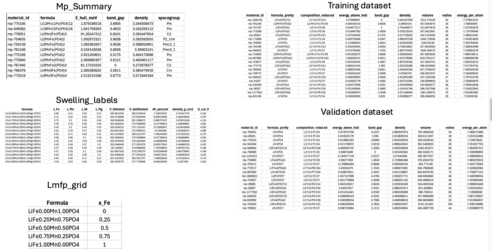
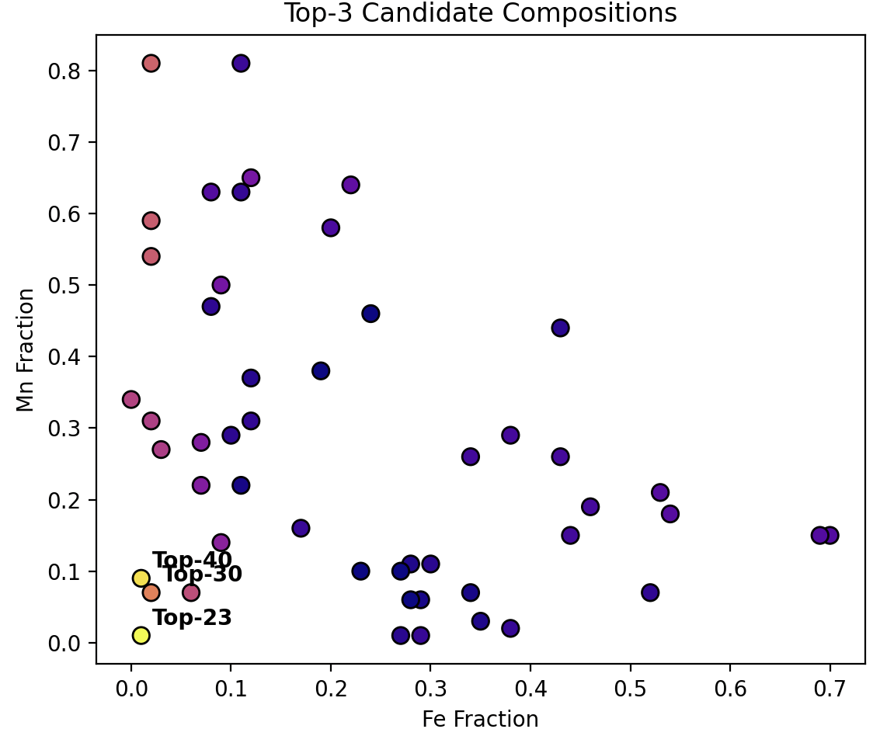
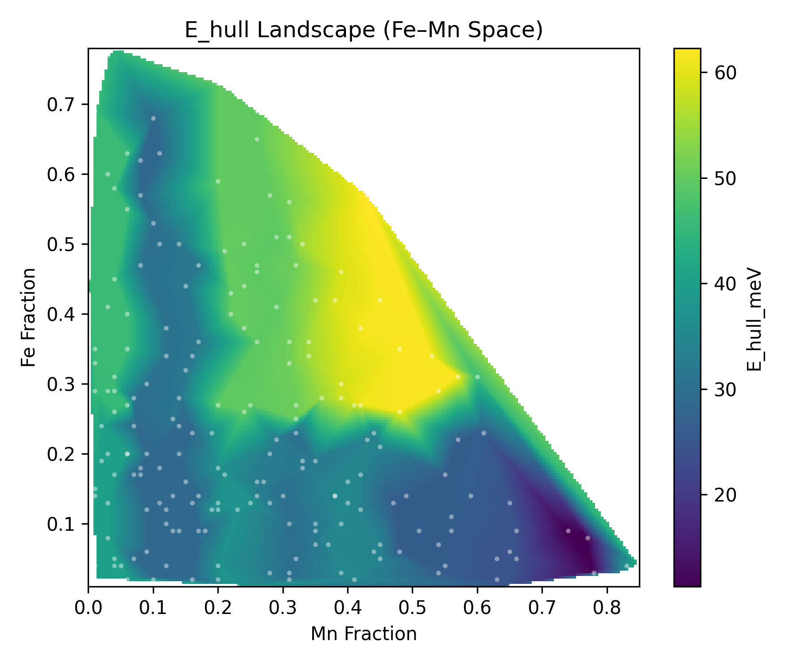
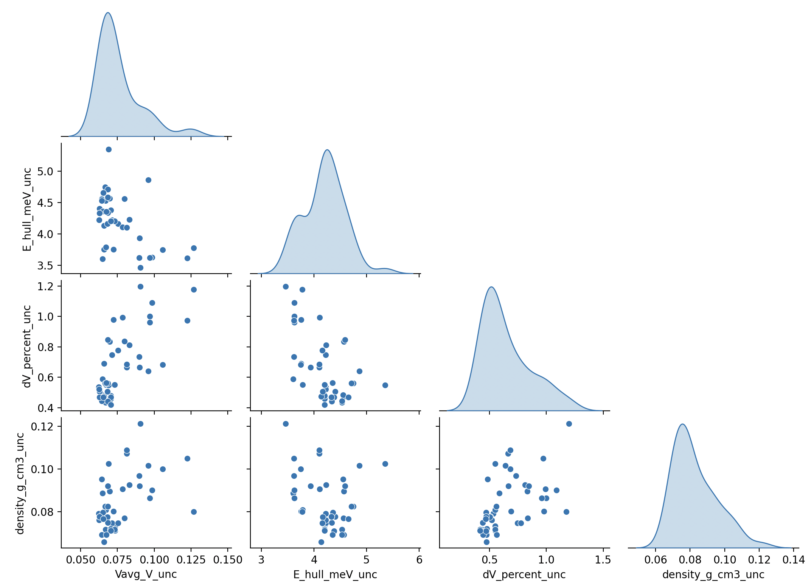
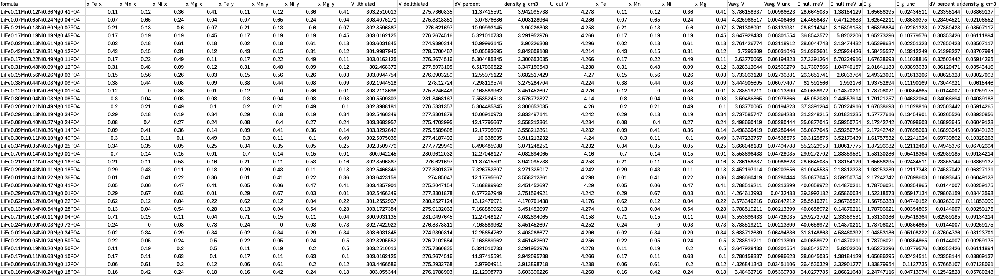
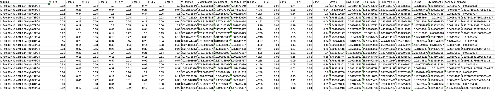
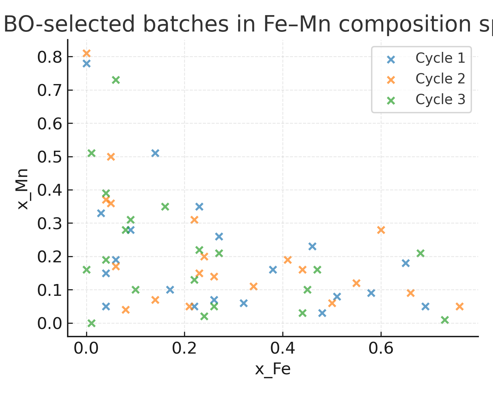

# AI-driven Materials Discovery for Li-ion Battery Cathodes

This is a **CPU-friendly materials discovery AI pipeline** that integrates GradBoostReg & Bayesian Optimization for designing stable doped olivine Li-battery cathodes Li(Fe,Mn,Ni,Mg)PO4 & predicting their EV pack-level relevant properties 

---

## 1. Motivation

(A) Battery performance & cost are heavily driven by the chemistry of cathode materials.

(B) LiFePO₄ (LFP) is safe and low-cost but has moderate energy density. LiMnPO₄ (LMP) & doped
variants can improve voltage and energy density but at the cost of stability.

(C) Designing Li -(Fe, Mn, Ni, Mg)-PO₄ (LMFP) variants is a high-dimensional optimization problem,
involving tuning of composition, stability, strain, voltage & manufacturability.

So the practical design problem is:

> **Search the Fe/Mn/Ni/Mg composition simplex for LMFP cathodes that balance**
> - high average voltage `V_avg`,
> - reasonably low `E_hull_meV`,
> - controlled lattice swelling `dV_percent`,
> - and a voltage profile compatible with a safe upper cut-off `U_cut`.

**Core Objective is to Develop an AI-driven automated framework that**:

A. Uses physics-aware ML surrogates trained on DFT/Experimental data

B. Predicts electrochemical & structural properties across the composition space

C. Applies Gaussian Process Bayesian Optimization to iteratively propose the most promising &
uncertain LMFP candidates for evaluation.

**From Problem to Strategy:**

Each LFMP candidate has multiple conflicting objectives like high average voltage, low formation energy
(stability), minimal volume change, etc. Direct DFT evaluation is too expensive & static ML prediction lacks adaptivity. Hence, we need a framework that can predict, quantify uncertainty & adaptively decide where to sample next. So, here I use **surrogate models + Bayesian optimization**.

---

## 2. What the pipeline actually does

At a high level:

1. **Build a data foundation** from Materials Project:
   - Fetch Pnma olivine endmembers (LFP, LMP, FePO4, MnPO4).
   - Construct an LMFP Vegard grid to estimate baseline structural trends.

2. **Train surrogate models** (one per property):
   - Average voltage `V_avg_V`
   - Energy above hull `E_hull_meV`
   - Band gap `E_g`
   - Lattice swelling `dV_percent`
   - Density `density_g_cm3`

3. **Generate candidate compositions** in Fe–Mn–Ni–Mg space (VAE-like sampler).

4. **Predict properties + uncertainties** for each candidate.

5. **Apply physics filters**:
   - `E_hull_meV ≤ ehull_cut` (metastability window)
   - `|dV_percent| ≤ dv_limit` (swelling constraint)
   - `V_avg_V ≤ U_cut_V` (stay within safety-informed cut-off)

6. **Run Gaussian-Process Bayesian Optimization (GP-BO)**:
   - Fit a GP on predicted `V_avg_V` (after filters).
   - Use Expected Improvement (EI) or UCB to pick the next batch.
   - Enforce diversity in composition space.

7. **Iterate over cycles**:
   - The BO-selected batch becomes the candidate pool for the next cycle.
   - Optionally, interleave new samples from the VAE generator.

The current version uses **single-objective BO on `V_avg_V`** after hard physics filters.  
A natural next step is multi-objective BO on (voltage, stability, swelling).


---

## 3. Repository layout

```text
MatGen_AI/
├── README.md
├── requirements.txt
├── run_all.sh              # Convenience shell script 
├── run_pipeline.py         # Main multi-cycle GP-BO driver
│
├── data/
│   ├── train.csv           # Training table for surrogate models
│   └── val.csv             # Held-out validation set
│
├── runs/
│   └── run1/               # Example experiment (created at runtime)
│       ├── data/           # mp_summary.csv, lmfp_vegard.csv, swelling labels, etc.
│       ├── cycle_01/
│       ├── cycle_02/
│       └── cycle_03/
│
├── analysis_outputs_bo/    # Optional plotting 
│
└── scripts/
    ├── fetch_mp_data.py
    ├── build_training_from_mp.py
    ├── build_swelling_dataset.py
    ├── train_swelling.py
    ├── train_models.py
    ├── predict_new.py
    ├── active_learning.py
    ├── vae_generator.py        
    └── analysis_full.py
```

---

## 4. Data Foundation

This part of the pipeline prepares all Materials Project (MP) data, Vegard-law interpolation, and physics-based swelling labels used by the surrogate and BO model.

The relevant scripts live in:
```text
scripts/
├── fetch_mp_data.py
├── build_training_from_mp.py
├── build_swelling_dataset.py
```

<p align="center">
  
  <br>
  <em>Figure 4: Snapshot of the data cleaning stages and different data files used for training & validation.</em>
</p>

---
## 5. Key Scripts 
## 5.1 `scripts/fetch_mp_data.py`

**Purpose:** Build the foundational Materials Project dataset for LMFP.

**What it does:**

- Connects to MP through `mp_api`.
- Queries all relevant olivine Pnma endmembers:
  - `LiFePO4`, `LiMnPO4`, `FePO4`, `MnPO4`
- Creates a Vegard-law Fe–Mn composition grid.
- Stores structural & thermodynamic data.​

**Outputs:**

`runs/<exp>/data/mp_summary.csv`

`runs/<exp>/data/lmfp_vegard.csv`

These contain raw MP data + interpolated lithiated/delithiated volumes.

---

## 5.2 `scripts/build_training_from_mp.py`

**Purpose:** Convert MP data to ML-ready training and validation sets.

**Does the following:**

- Reads `mp_summary.csv`
- Extracts composition features:
  - `x_Fe`, `x_Mn`, `x_Ni`, `x_Mg`
- Computes/normalizes needed features.
- Splits into `train.csv' & `val.csv`

**Outputs:**

`data/train.csv`

`data/val.csv`

These are the only datasets used to train all surrogate models.

---

## 5.3 `scripts/build_swelling_dataset.py`

**Purpose:** Fast, closed-form physics labels (lattice swelling, density, etc.).

This script applies Vegard-law formulas:

$$
V_{lith}(x) = x V_{LFP} + (1-x)V_{LMP}
$$

$$
V_{delith}(x) = x V_{FePO_4} + (1 - x) V_{MnPO_4}
$$

$$
\Delta V\% = {V_{lith}(x) - V_{delith}(x)}/{V_{delith}(x)}
$$

$$
U_{cut}(x_{Fe}) \approx 4.30 - 0.20 \* x_{Fe}
$$

$$
U_{cut} = \min\left( \max(V_{max} - m, 0), V_{cap} \right)
$$

**Outputs include:**

- `x_Fe`
- `V_lithiated`
- `V_delithiated`
- `dV_percent`
- `density_g_cm3`
- `U_cut_V`

These are lightweight physics labels used during BO filtering.

---

## 5.4 `scripts/train_swelling.py`

**Purpose:** High-fidelity physics labels (more accurate than the analytic version).

Adds:

- Per-formula-unit normalization  
- Upper-plateau voltage estimation  
- Practical safety cutoff:
  
$$
U_{cut} = \min\left( \max(V_{max} - m, 0), V_{cap} \right)
$$

Used when preparing more rigorous physical datasets.

---

## 5.5 `scripts/train_models.py`

**Purpose:** Train ML surrogate models for:

- Average voltage: `Vavg_V`
- Formation energy above hull: `E_hull_meV`
- Band gap: `E_g`
- Lattice swelling: `dV_percent`
- Density: `density_g_cm3`

**Model type:**  
Gradient boosting fits a sequence of small regression trees, each one correcting the errors (“residuals”) made by the previous ensemble.
It performs well on small scientific datasets, handles non-linear interactions, and is extremely fast on CPU.
For each property, the pipeline trains 7 independent GBR models (different random seeds).
This gives: a mean prediction (robust surrogate) and an ensemble standard deviation, used as uncertainty for BO. This uncertainty is essential because BO needs both the surrogate mean and an estimate of predictive confidence.

Mathematical Formulation: Each GBR model is an additive sequence of regression trees:

$$
f^{(M)}(x) = f_0(x) + \sum_{m=1}^{M} \nu * h_m(x)
$$

Where:

	•	f_0(x) = initial prediction (for squared loss to mean of y_i)
	
	•	v in (0,1] = learning rate
	
	•	h_m(x) = regression tree fitted at boosting step m
	
	•	M = number of boosting stages (≈ 500)

Tree structure:
Each regression tree partitions the feature space into leaf regions R_{m,j}.
Inside each region, the tree prediction is constant:

$$
h_m(x) = \sum_{j=1}^{J_m} \gamma_{m,j}, \mathbf{1}{x \in R_{m,j}}
$$

Where:
	•	J_m = number of leaf nodes
	•	gamma_{m,j} = optimal leaf value

Training Objective: Squared Loss
Gradient Boosting minimizes:

$$
L = \sum_{i=1}^N \frac{1}{2}\left(y_i - f^{(M)}(x_i)\right)^2
$$

Step-wise Boosting Update

a. Compute residuals (negative gradient):

$$
r_i^{(m)} = -\left. \frac{\partial L}{\partial f(x_i)} \right|_{f = f^{(m-1)}}
= y_i - f^{(m-1)}(x_i)
$$

b. Fit regression tree to residuals

Train tree h_m(x) to map:

$$
x_i \rightarrow r_i^{(m)}
$$

c. Compute optimal leaf value

For each leaf region R_{m,j}:

$$
\gamma_{m,j} = \arg\min_{\gamma} \sum_{x_i \in R_{m,j}}
\left(r_i^{(m)} - \gamma\right)^2
$$

This simplifies to the mean residual inside the leaf.

d. Update the big model

$$
f^{(m)}(x) = f^{(m-1)}(x) + \nu, h_m(x)
$$

For each property, we train 7 GBR models taht yield:

Ensemble Mean

$$
mu(x) = \frac{1}{7} \sum_{m=1}^{7} f_m(x)
$$

Ensemble Variance → Uncertainty

$$
sigma(x) = \sqrt{\frac{1}{7} \sum_{m=1}^{7} \left( f_m(x) - \mu(x) \right)^2}
$$

This \sigma(x) is passed to Bayesian Optimization (GP-BO) to reflect model confidence.

The following features are extracted from the MP summary and Vegard grid:
1. Mass fractiosn of Fe, Mn, Ni and Mg
2. MP-derived:

- `energy_above_hull`

- `band_gap`

- `density`

- `volume`

- `nsites`

- `energy_per_atom`

These are standardized using sklearn StandardScaler, whose statistics are saved as:
`runs/final_models/artifacts/*_scaler.joblib`
	​
**Outputs stored in:**
```text
runs/final_models/artifacts/
├── <target>_member1.joblib
├── ...
├── <target>_scaler.joblib
└── metadata.json
```
---

## 5.6 `scripts/vae_generator.py`

**Purpose:** Generate new LMFP compositions for exploration.
**Method:**

Samples dopant fractions from a Dirichlet distribution:

$$
(x_{Fe}, x_{Mn}, x_{Ni}, x_{Mg}) \sim \mathrm{Dir}(\alpha)
$$

Produces formulas like:
LiFe_x Mn_y Ni_z Mg_w PO4

**Output:** `generated_candidates.csv`
This is the generator used before each BO cycle.

---

## 5.7 `scripts/predict_new.py`

**Purpose:** Apply trained surrogate models to new compositions.
**What it does:**
Loads all trained GBR ensemble members + scalers. Aligns candidate features to training schema. Computes μ (mean) and σ (uncertainty) for each property.

**Output:** `predictions_calibrated.csv`

Given a CSV of candidate compositions: Loads trained ensemble models from `runs/final_models/artifacts/`. This file becomes the input to Bayesian Optimization.


<p align="center">
  
  <br>
  <em> Figure 5.0: Top 3 predicted candidates from the surrogate model ensemble without any adaptive sampling or optimization.</em>
</p>

<p align="center">
  
  <br>
  <em>Figure 5.1: Predicted E-hull landscape vs Fe & Mn mass fractions</em>
</p>

<p align="center">
  
  <br>
  <em>Figure 5.2: Predicted Average Voltage landscape vs Fe & Mn mass fractions</em>
</p>

<p align="center">
  
  <br>
  <em>Figure 5.3: Predicted Uncertainties</em>
</p>

**Figure 5.3**: Joint distribution of surrogate-model prediction uncertainties across LMFP candidates.
This pair-plot summarizes the epistemic uncertainty estimated from the 7-member Gradient Boosting ensemble for four key predicted properties:
(i) average voltage V_avg,
(ii) formation energy above hull,
(iii) lattice swelling Delta V%, and
(iv) crystal density 

Diagonal panels show kernel-smoothed uncertainty histograms, revealing that:

	•	V_avg uncertainties are tightly concentrated (0.05–0.15 V),
	
	•	E_hull uncertainties fall mostly within 3.5–5.5 meV,
	
	•	swelling delta V% uncertainty clusters between 0.4–1.0%, and
	
	•	density uncertainties lie around 0.07–0.11 g/cm³.

Off-diagonal scatter plots show how uncertainties co-vary across properties. Mild positive correlation appears between swelling and density uncertainties, consistent with both depending on Vegard-law–derived volume terms; while voltage uncertainties remain largely independent from the structural labels. Overall, the figure highlights that the surrogate ensemble is well-behaved, smooth and stable, and that uncertainity structure is physically interpretable, providing a reliable basis for Gaussian-process Bayesian Optimization acquisition functions.


## 5.8. `active_learning.py` --> Gaussian Process Bayesian Optimization (GP-BO)
**A. Physics Filters**

Candidates must satisfy. These guarantee BO does not pick unstable or unsafe chemistries.:

(i) E_hull_meV ≤ ehull_cut (default: 50 meV)

(ii) |dV_percent| ≤ dv_limit (default: 12%)

(iii) V_avg_V ≤ U_cut_V (safety constraint)


**B. Objective**

For now, BO is single-objective, maximizing:

f(x) = predicted V_avg_V(x)

$$
f(x) \mid \mathcal{D} \sim \mathcal{N}(\mu(x), \sigma^2(x))
$$

**C. Gaussian Process Model**

Uses a Matérn kernel with automatic length scales. Fits a GP on surrogate predictions in dopant-fraction space:
Inputs: `x_Fe, x_Mn, x_Ni, x_Mg`
Target: predicted `V_avg_V`

$$
k(r) = \sigma_f^2 \left( 1 + \sqrt{5}r + \frac{5}{3}r^2 \right) e^{ -\sqrt{5} r }
$$

$$
r = \frac{ \lVert x - x' \rVert }{\ell}
$$

Gaussian Procvess returns:

μ(x) → mean voltage surface

σ(x) → uncertainty (exploration signal)

**D. Acquisition Function (Expected Improvement)**

Expected Improvement (EI) quantifies the expected gain over the best V_avg observed so far.
Given mean μ, uncertainty σ, and best value f*, EI(x) computes how promising a point is.

$$
z = \frac{\mu(x) - f^* - \xi}{\sigma(x)}
$$

$$
EI(x) = (\mu(x) - f^* - \xi)\Phi(z) + \sigma(x)\phi(z)
$$

**E Diversity Selection**

After scoring by EI, a max–min diversity filter spreads points across composition space. Prevents BO from collapsing to a tiny region of Fe–Mn space.

Output: `next_batch_for_labeling.csv`

This becomes input to the next cycle or to high-fidelity labeling (e.g., DFT). 

Once acquisition values a(x) (EI by default) are computed for all candidates, the pipeline constructs a batch using two criteria:

Step 1 — Acquisition Ranking

Sort all candidates x \in \mathcal{F} by their BO score. The top candidate initializes the batch:

$$
x_1 = \arg\max_{x \in \mathcal{F}} a(x)
$$

Step 2 — Max–Min Diversity in Feature Space

Let Z(x) denote the feature vector used for BO (e.g., dopant fractions and/or predicted properties).

We iteratively add points that are maximally far from the current batch in Euclidean space:

$$
x_{t+1} = \arg\max_{x \in \mathcal{F}} ; \min_{1 \le i \le t} ; | Z(x) - Z(x_i) |_2
$$

This is the classical farthest-point sampling rule.

Interpretation:
Even if acquisition prefers similar high-value candidates, the Max–Min rule forces the batch to explore diverse regions of the LMFP composition simplex, preventing BO from collapsing around one dopant combination. This is particularly useful when batches are used to propose parallel experiments.


<p align="center">
  
  <br>
  <em>Figure 5.4: Snapshot of Predicted Candidates from the surrogate model output `predicted_calibrated.csv` </em>
</p>

<p align="center">
  
  <br>
  <em>Figure 5.5: Snapshot of Sampled Candidates to be used as next batch for labelling obtained after BO run and stored for each cycle as `next_batch_for_labelling.csv`</em>
</p>

<p align="center">
  
  <br>
  <em>Figure 5.6: BO-selected compositions across cycles.</em>
</p>


## 6. What Comes Next (Future Directions)

This repository is actively evolving toward a **full multi-objective, uncertainty-aware materials discovery framework**.
Upcoming extensions include:

- Successfully implementing BO on a more stricter objective and use it on large dataset (~10000)
- Incorporating **SCFCs** (structure–composition feature correlations)    
- Performing **cost-aware BO**  
- Adding **constraint-based candidate pruning**    
- Scaling to quaternary/quinary LMFP-Ni-Mg doped systems  
- Adding **model interpretability** (SHAP, feature attributions)

---
## 7. Pipeline Execution
## 7.1 run_pipeline.py

Coordinates an entire multi-cycle run:

i) Build MP data

ii) Build swelling labels

iii) Train/Load surrogate models

iV) For each cycle: generate new candidates

v) Predict properties

vi) Select next batch with GP-BO

## 7.2 run_all.sh

chmod +x run_all.sh

export MP_API_KEY="your_actual_key"

./run_all.sh

## 8. Quick Start
# Clone
git clone (https://github.com/anic6878/AI-pipeline-for-Li-Battery-Materials-Design)


# Environment
python -m venv .venv

source .venv/bin/activate  

pip install -r requirements.txt


